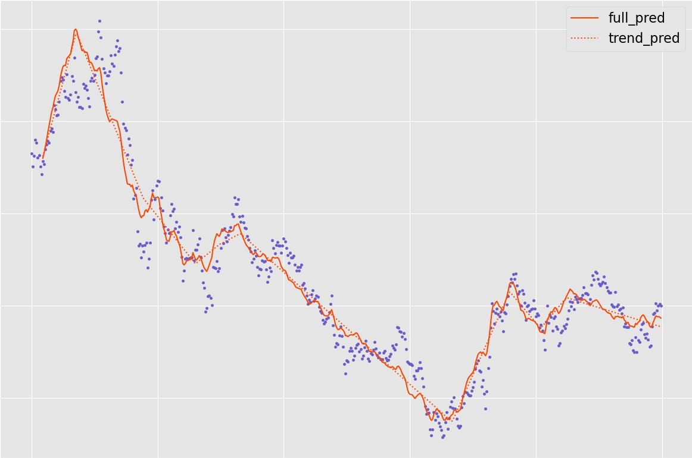

The deep-plats library provides functionalities for analyzing timeseries in a piecewise linear fashion with deep neural networks.

&nbsp;

Requirements
==================
- torch
- pandas
- numpy
- tqdm

&nbsp;

Installation
============

```bash
pip install deepplats
```

Both a `requirements.dev.txt` as well as a `requirements.dev.yml` are provided for reproducing the development environment
either through pip or conda.


&nbsp;

Minimal example
===============

In-sample forecast.

```python
import matplotlib.pyplot as plt
from deepplats import DeepPLF
from deepplats.utils import get_data

df = get_data('example1')
y = df.value.to_numpy[-500:]
X = np.arange(y.size)
deepplf = DeepPLF(lags=10, horizon=1, breaks=10)
deepplf.fit(X, y, epochs=5000)
# predict on x and lagged rolling y sequences.
pred = deepplf.predict(X, y).detach().numpy()
trend = deepplf.predict(X, y, mod='trend').detach().numpy()
plt.plot(X[-pred.size:], pred, c='C1')
plt.plot(X[-pred.size:], trend, c='C1', linestyle=':')
```


&nbsp;

Note on non-linearity
=====================

Non-linearities are used throughout the DeepPLF model. The linearity refers to the piecewise linear regression which
forms the basis on which other non-linear model extensions are added.
